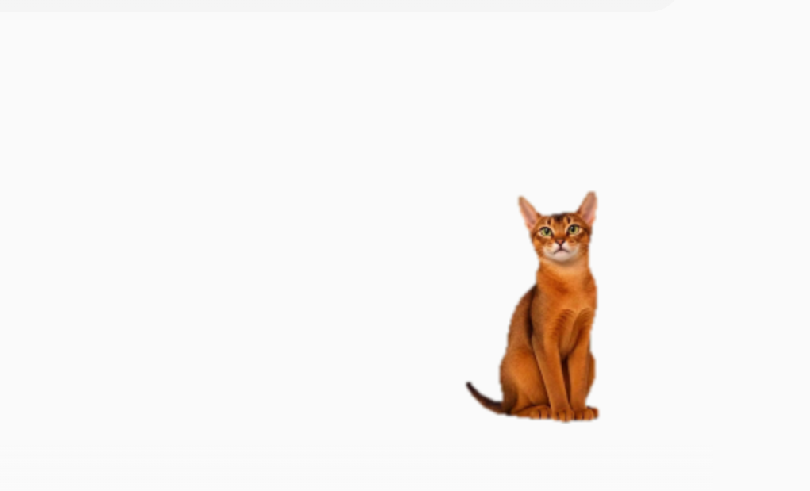

# 阿比西尼亚猫桌宠

一个由绿幕视频驱动的 Windows 桌面宠物。它会将视频中的绿色背景实时抠除，以无边框、透明、置顶的小窗口显示在桌面上。

> 运行效果截图



## 功能

- 实时绿幕抠图、边缘柔化与去绿边。
- 无边框透明窗口、始终置顶、可拖动，且点击时不抢占焦点。
- 待机与随机动作；单击、双击分别触发不同动作。
- 睡眠模式与鼠标跟随模式。
- 系统托盘菜单：显示/隐藏、缩放、随机动作间隔、模式切换和退出。
- 通过 `pet.json` 配置桌宠名称、动作视频、绿幕参数、缩放和随机行为；制作新桌宠无需修改 Python 源码。

## 快速运行

适用平台：Windows 10/11 x64。

1. 从 GitHub Releases 下载最新的 `DesktopPet-clean.zip`，并完整解压。
2. 保持文件夹结构不变，不要单独移动 `DesktopPet.exe`。
3. 双击 `DesktopPet.exe` 启动桌宠；右键桌宠可打开菜单，或通过系统托盘图标操作。

发布包中必须同时保留 `DesktopPet.exe`、`pet.json`、所有视频文件和 `_internal` 文件夹。

## 从源码运行与重新打包

需要 Python 3.9（64 位）。请使用项目内独立虚拟环境，避免系统 Python 或 Anaconda 中的依赖干扰。

```powershell
python -m venv .venv-build
.\.venv-build\Scripts\python.exe -m pip install --upgrade pip
.\.venv-build\Scripts\python.exe -m pip install -r requirements.txt

# 预览运行
.\.venv-build\Scripts\python.exe desktop_pet.py

# 构建发布包
powershell -ExecutionPolicy Bypass -File .\build.ps1
```

构建完成后，将生成的 `release\DesktopPet-clean` 整个文件夹发送给使用者。

## 制作自己的桌宠

1. 复制本项目的 `desktop_pet.py`、`requirements.txt`、`build.ps1` 和 `pet.example.json`。
2. 新建 `videos` 文件夹；将 `pet.example.json` 改名为 `pet.json`，并保持 `video_directory` 为 `videos`。
3. 按 `actions` 中每个动作对应的 `file` 名称放入视频。`idle` 为必需动作；缺少其他动作时，程序会回退播放待机视频。
4. 按上节创建独立环境，预览效果后再执行构建脚本。

## 素材规范

- 建议使用 MP4（H.264）、30 fps；所有视频保持相同分辨率、主体大小、位置与镜头比例。
- 背景应为均匀绿色；主体避免大面积绿色衣物或饰品。光线或绿幕色相变化明显时，请在 `pet.json` 调整 `chroma_key`。
- `idle` 是循环待机视频；`turn_around` 对应单击，`lie_back` 对应双击。
- `head_turn` 用于鼠标跟随：建议制作主体顺时针旋转一周、第一帧朝上的连续视频。
- 为避免动作切换时跳动，请让每段素材中主体的锚点保持一致。

## 配置说明

`pet.json` 的主要字段：

- `name`：托盘提示和应用名称。
- `video_directory`：相对 `DesktopPet.exe` 的素材目录；当前示例使用 `.`，新项目建议使用 `videos`。
- `base_scale`、`default_scale`：视频基础缩放和启动时显示缩放。
- `random_interval_seconds`、`random_actions`：随机动作的间隔与候选动作。
- `actions`：程序动作名到视频文件名的映射。
- `chroma_key`：绿幕抠图阈值；色相范围为 OpenCV HSV 的 0–179，其他值为 0–255。

## 视频素材与授权

本仓库中的阿比西尼亚猫绿幕视频由仓库维护者提供，并随项目在 MIT License 下公开发布。复制、修改或再分发前，请保留原始版权与许可证声明；如素材中涉及第三方肖像、音乐、商标或其他受保护内容，请先取得相应授权。

## 许可证

本项目的代码、文档与仓库中提供的绿幕视频均采用 [MIT License](LICENSE)。你可以使用、复制、修改、发布、再分发及商用，但必须保留原始版权声明与许可证文本。
